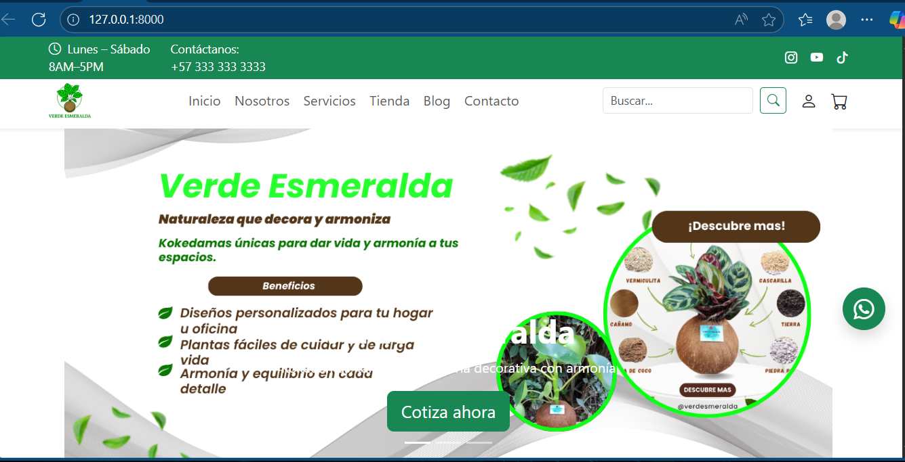
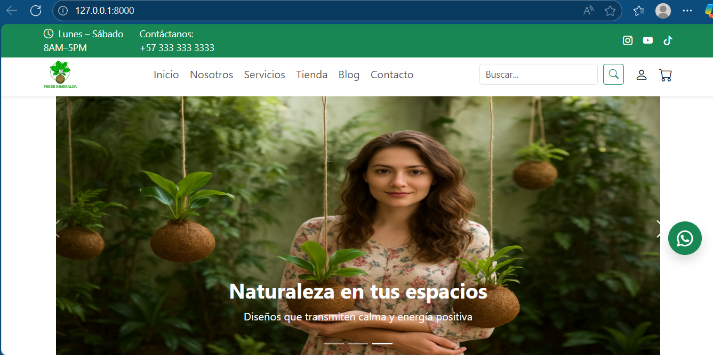

# 🌱 Verde Esmeralda

**Verde Esmeralda** es un proyecto **e-commerce** para la venta de kokedamas, desarrollado en el marco del proceso de formación del **Tecnólogo en Desarrollo Web y Multimedia del SENA**.  

📌 **Nota:** Este proyecto se encuentra en fase de desarrollo.

## Vista previa 

### Pagina principal





🔗 Repositorio oficial: [Verde Esmeralda](https://github.com/carlos03777/verdeEsmeralda.git)
🔗 Documentación en Notion: [Verde Esmeralda](https://balanced-knave-afa.notion.site/Verde-Esmeralda-15a3d0a8e8488095a6bcecf7790be9e2?source=copy_link)
---

## 🚀 Características principales
- Tienda en línea para la venta de kokedamas.  
- Gestión de productos.  
- Interfaz responsive con **Bootstrap**.  
- Integración con base de datos **MySQL**.  
- Backend en **Django** y **Python**.  

---

## 🛠 Tecnologías utilizadas
- [Django](https://www.djangoproject.com/)  
- [Python](https://www.python.org/)  
- [MySQL](https://www.mysql.com/)  
- [Bootstrap](https://getbootstrap.com/)  
- JavaScript  
- HTML5 / CSS3  

---

## ⚙️ Instalación y ejecución

1. **Clonar este repositorio**  
   ```bash
   git clone https://github.com/carlos03777/verdeEsmeralda.git
   cd verdeEsmeralda```

2. **Crear y activar entorno local**

python3 -m venv venv
source venv/bin/activate   # Linux / Mac
venv\Scripts\activate      # Windows (PowerShell)

3. **Instalar dependencias**
pip install -r requirements.txt

4. **Aplicar migraciones**
python manage.py migrate

5. **Ejecutar el servidor**
python manage.py runserver


💻 Autor

Proyecto desarrollado por Carlos Forero
SENA – Tecnólogo en Desarrollo Web y Multimedia
